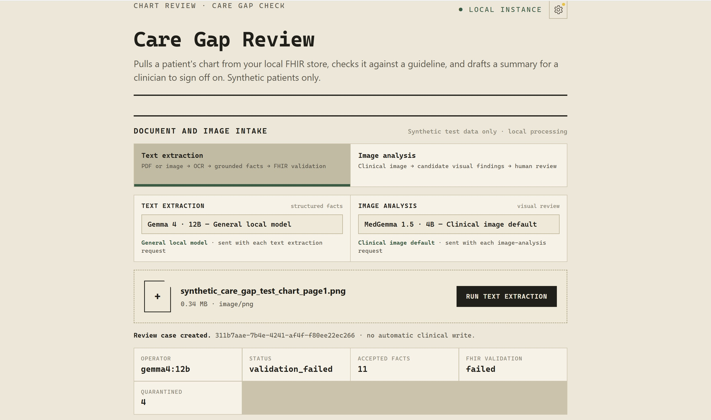
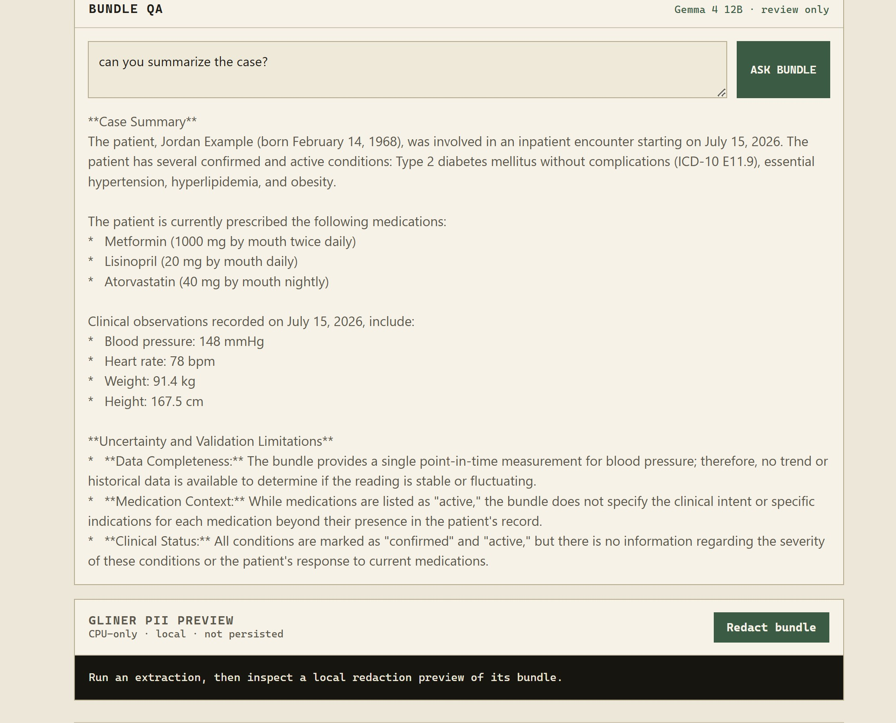

# Evidence-First FHIR

[](https://www.python.org/downloads/)
[](https://hl7.org/fhir/R4/)
[](LICENSE)
[](https://github.com/AubinGil/evidence-first-fhir/actions/workflows/tests.yml)

An evidence-first reference pipeline for turning clinical documents into **reviewable FHIR R4 candidate resources**. Source documents are untrusted, extracted facts require provenance, and persistence is disabled by default.

> **Research/reference software only.** This project is not a medical device and is not validated for clinical deployment, diagnosis, treatment, or autonomous decision-making. Do not use production PHI or connect it to a production FHIR server without suitable security, privacy, legal, and clinical validation.

```text
synthetic document -> extraction -> evidence gate -> FHIR proposal
                                         |                |
                                      quarantine       human approval
                                                            |
                                                    optional persistence
```

The default configuration is synthetic-data-only, read-only for FHIR, telemetry-off, and write-disabled. Every candidate fact carries an exact source span and document hash.

## Why this exists

Most document-to-FHIR demos will happily emit a structured resource that no one can trace back to the source text. This pipeline inverts that: a model's output is treated as a *claim*, not a fact. A claim that cannot be matched to an exact span in the source document is quarantined rather than mapped, and nothing reaches a FHIR server without a recorded human approval.

The design goal is that every proposed resource can answer three questions: which document produced it, which exact characters support it, and who approved it.

## Quick start

```powershell
git clone https://github.com/AubinGil/evidence-first-fhir.git
Set-Location evidence-first-fhir
Copy-Item .env.example .env
python -m pip install -e ".[dev]"
python -m pipelines.ingestion.demo
python -m pytest
```

The demo makes no network calls and uses a synthetic document. Expected output is a single grounded candidate fact with a SHA-256 document hash, character offsets, and `review_status: pending`:

```json
{"subject": "synthetic-patient-001", "category": "allergy", "value": "penicillin",
 "evidence": {"document_sha256": "2def1406...", "start": 33, "end": 51,
              "quote": "penicillin allergy"},
 "confidence": 0.98, "review_status": "pending"}
```

## How the safety posture is enforced

The guarantees above are code and tests, not documentation:

| Guarantee | Enforced by |
|---|---|
| No fact without exact provenance | `pipelines/grounding/evidence.py` — an unmatched quote returns `None` (quarantine) |
| No write without approval **and** deployment opt-in | `policies/write_guard.py` — requires `review_status == "approved"` plus two env flags |
| Documents cannot influence policy | `tests/adversarial/test_document_injection.py` |
| Grounding and guard behavior | `tests/safety/` |

Persistence requires `CLINICAL_FHIR_ALLOW_WRITES=true` *and* `CLINICAL_FHIR_FHIR_READ_ONLY=false`. Both default to the safe value, and an approved review decision is still required on top of them.

## Evaluation

`goldset/` holds 12 frozen, fully synthetic fixtures covering the failure modes that matter clinically — negation, uncertainty and conditional plans, allergy versus tolerance, family history, historical versus planned procedures, section-header traps, lab units, and demographics.

Scoring never calls a model. Inference runs once per model and writes prediction files; all scoring runs against those stored files, so comparisons are reproducible and CI-safe:

```bash
python goldset_predict.py --model medgemma:27b        # requires local Ollama
python goldset_score.py output/goldset/medgemma-27b --report output/goldset/medgemma-27b/report.json
```

Reports embed the gold set `VERSION` plus a SHA-256 checksum of all fixtures, tying every result to a frozen set. Fixtures carry `review_status: draft` — these annotations are not clinical validation until a clinician reviews them.

## What review looks like

> **Not included in this repository.** The screenshots below are from the reference implementation's review front-end, kept in a separate private workbench. They illustrate the intended human-approval surface; this repository ships the pipeline, grounding, policy, and evaluation layers that sit behind it.



The reviewer sees the operator model, the validation result, and the quarantine count before deciding anything. Above, 11 facts were accepted and 4 quarantined while FHIR validation failed — a case that must not proceed silently.



Bundle QA is review-only: it summarizes the assembled bundle and states its own uncertainty and validation limitations rather than asserting clinical conclusions. A local, CPU-only PII preview runs before anything leaves the workstation, and it is not persisted.

## Repository layout

| Path | Contents |
|---|---|
| `pipelines/` | Ingestion, grounding, FHIR mapping — plus de-identification, extraction, and care gaps as documented interfaces, not implementations |
| `policies/` | Persistence authorization (write guard) |
| `providers/` | Provider interfaces — documentation until explicitly implemented and configured |
| `goldset/` | Frozen synthetic evaluation fixtures |
| `tests/` | Safety, adversarial, and integration tests |
| `schemas/` | Candidate fact JSON Schema |
| `synthetic_data/` | Synthetic FHIR R4 patient fixture |
| `terminology/` | Terminology source notes |
| `docs/` | Architecture and threat model |

Provider folders are interfaces and documentation until explicitly implemented and configured. The same applies to `pipelines/deidentification/`, `pipelines/extraction/`, and `pipelines/care_gaps/`: each documents a required interface and its validation burden, and each contains a README rather than code. Only ingestion, grounding, and FHIR mapping execute. No network calls are made by the synthetic demo.

## Scope

This repository is deliberately minimal: the pipeline, its safety policy, and its evaluation harness. Everything here runs from a clean clone with no credentials, no external services, and no clinical data. Orchestration, storage, infrastructure, and the review front-end belong to a deployment and are intentionally out of scope.

No credentialed dataset is used, referenced, or required. The gold set is synthetic by construction so it can live in Git and run in CI.

## Documentation

- [Architecture](docs/architecture.md) — trust boundaries and pipeline stages
- [Threat model](docs/threat-model.md) — assets, threats, controls, and security invariants
- [Model card](MODEL_CARD.md) — intended use, prohibited use, and limitations
- [Security policy](SECURITY.md) — reporting and non-negotiable deployment controls
- [Contributing](CONTRIBUTING.md) — the safety posture contributions must preserve

## Development tools

This project was developed with assistance from Claude and Codex for code review, documentation, and implementation support. Architecture, safety decisions, validation, and publication remain the responsibility of the repository owner.

## License

[MIT](LICENSE)
