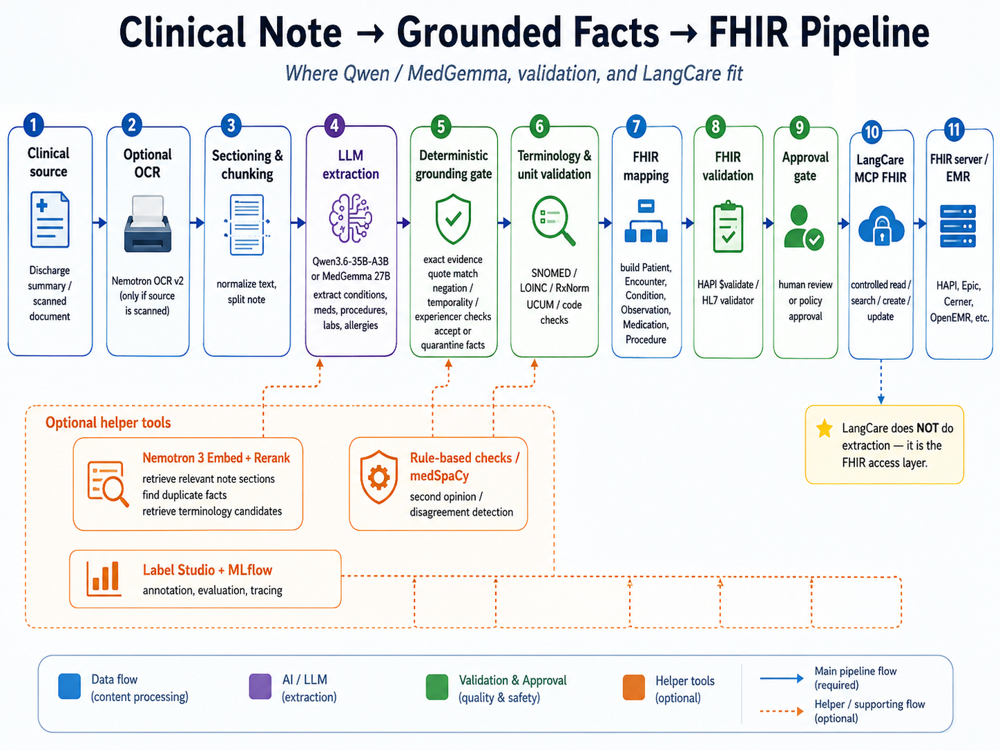

# Architecture

The reference flow deliberately separates untrusted transformation steps from policy enforcement:

```text
ingestion -> de-identification -> extraction -> grounding -> review -> FHIR proposal
                                                            |
                                                       persistence guard
```

Provider responses are candidate data only. Grounding verifies exact evidence before a candidate reaches review. The reviewer approves or rejects a candidate; only an approved candidate can become a FHIR proposal. Persistence remains disabled unless the deployment separately enables it and provides an audited FHIR adapter.


